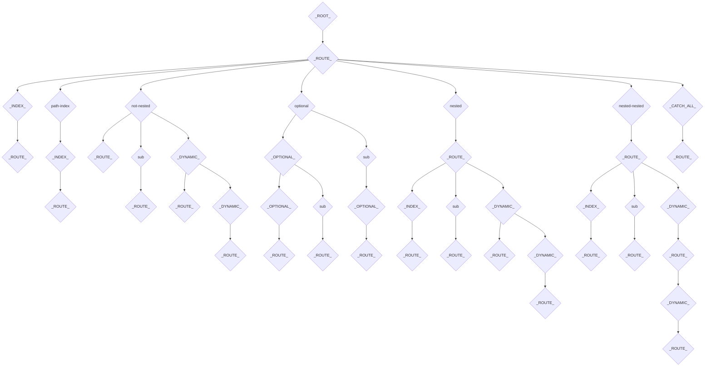

# router-trie

## Usage

```bash
npm i router-trie
```

```js
import { createTrie, matchTrie } from "router-trie";

const routesTrie = createTrie([
  {
    id: "root",
    children: [
      {
        id: "home",
        index: true,
      },
    ],
  },
]);

const matches = matchTrie(routesTrie, "/");

console.log(matches);
// [{ id: "root" }, { id: "home", index: true }]
```

## Development

To install dependencies:

```bash
npm i
```

To run the playground:

```bash
npm start
```

To run the tests:

```bash
npm test
```

Visual of the trie structure:

Given the following routing config: [routes.json](./routes.json)

We get the following trie:


