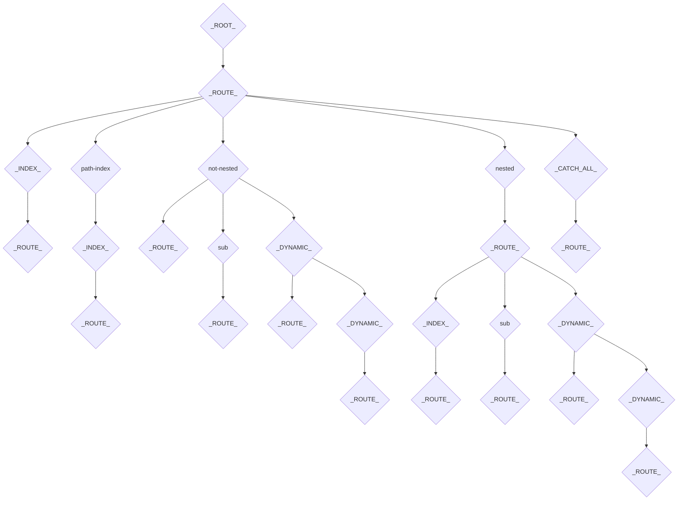

# router-trie

## Usage

```bash
npm i router-trie
```

```js
import { createTrie, matchTrie } from "router-trie";

const routesTrie = createTrie([
  {
    id: "root",
    children: [
      {
        id: "home",
        index: true,
      },
    ],
  },
]);

const matches = matchTrie(routesTrie, "/");

console.log(matches);
// [{ id: "root" }, { id: "home", index: true }]
```

## Development

To install dependencies:

```bash
npm i
```

To run the playground:

```bash
npm start
```

To run the tests:

```bash
npm test
```

Visual of the trie structure:

Given the following routing config:

```js
[
  {
    id: "root",
    children: [
      {
        id: "home",
        index: true,
      },
      {
        id: "path-index",
        path: "path-index",
        index: true,
      },
      {
        id: "not-nested",
        path: "not-nested",
      },
      {
        id: "not-nested-sub",
        path: "not-nested/sub",
      },
      {
        id: "not-nested-dynamic",
        path: "not-nested/:id",
      },
      {
        id: "not-nested-dual-dynamic",
        path: "not-nested/:id/:id2",
      },
      {
        id: "nested",
        path: "nested",
        children: [
          {
            id: "nested-index",
            index: true,
          },
          {
            id: "nested-sub",
            path: "sub",
          },
          {
            id: "nested-dynamic",
            path: ":id",
          },
          {
            id: "nested-dual-dynamic",
            path: ":id/:id2",
          },
        ],
      },
      {
        id: "catch-all",
        path: "*",
      },
    ],
  },
];
```

We get the following trie:


